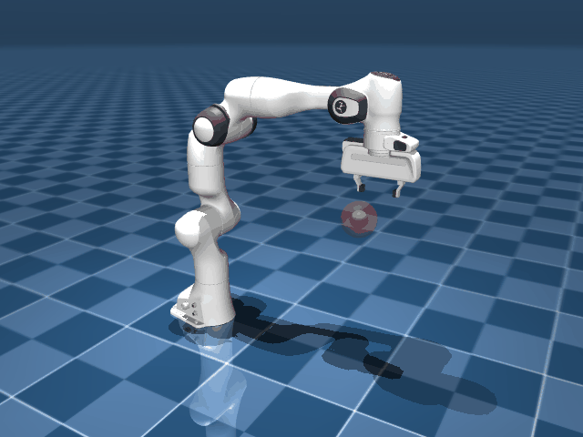

<div align="center">
  
  <h1>Robotic Arm RL Manipulation</h1>
  <p><em>Reinforcement learning-based continuous control of a 7-DOF Franka Emika Panda manipulator in MuJoCo.</em></p>
</div>

---

## Overview

This repository provides a modular pipeline for training continuous control policies on a 7-Degree-of-Freedom (7-DOF) Franka Emika Panda robotic arm using Deep Reinforcement Learning (DRL). Leveraging the MuJoCo physics engine and Stable-Baselines3, the project demonstrates scalable approaches to complex manipulation tasks, beginning with a dense-reward reach-to-target objective.

The architecture isolates environment definitions, training logic, and evaluation utilities, providing a foundation for scalable robotics research involving high-fidelity simulation and advanced policy optimization techniques.

> **Current Status: Model Training Complete (v2)**
> Proximal Policy Optimization (PPO) agents have been successfully trained on the reaching task, achieving a 100% success rate. The current policy incorporates strict orientation constraints, smoothness penalties, and curriculum learning to produce natural, robust end-effector trajectories.

## Technical Architecture

### 1. Custom Gymnasium Environment (`PandaReach-v0`)

The core of the simulation is a fully custom, Gymnasium-compliant environment (`envs/reach_env.py`) that interfaces directly with MuJoCo's C-bindings for maximal throughput.

- **State Space (23-dim)**: Includes joint positions (7), joint velocities (7), end-effector position (3), end-effector Z-axis orientation (3), and target spatial coordinates (3).
- **Action Space (7-dim)**: Continuous, bounded $[-1.0, 1.0]$. The policy outputs normalized delta joint-position commands, which are scaled and applied to the robot's actuators.
- **Reward Function**: A dense, multi-objective formulation:
  - *Position Penalty*: Euclidean distance between the end-effector and the target.
  - *Orientation Penalty*: Cosine similarity-based penalty enforcing a strict downward-facing $(-Z)$ end-effector orientation.
  - *Smoothness Penalty*: L2-norm of the action derivative ($\Delta a$) to prevent jerky trajectories.
  - *Success Bonus*: +10 terminal reward (plus an orientation alignment bonus) when the end-effector falls within the success threshold (0.05m).
- **Curriculum Learning**: The target sampling volume begins constrained to a centralized sub-volume and linearly expands to the full reachable workspace over the initial warmup episodes.

### 2. Reinforcement Learning Pipeline

The training pipeline (`train/train_rl.py`) employs Stable-Baselines3 to optimize a PPO agent.

- **Algorithm**: Proximal Policy Optimization (PPO) with Generalized Advantage Estimation (GAE).
- **Network Architecture**: Custom Multi-Layer Perceptron (MLP) featuring a `[512, 256, 128]` hidden layer structure with `Tanh` activations for both the policy and value networks.
- **Parallelization**: Utilizes `SubprocVecEnv` for asynchronous, multi-process environment stepping.
- **Normalization**: Incorporates `VecNormalize` to dynamically scale observations and rewards, improving gradient stability.
- **Optimization Strategy**: Employs a linear learning rate decay schedule starting from $3 \times 10^{-4}$.

## Repository Structure

```text
Robotic-Arm-RL-Manipulation/
├── envs/                     # Custom Gymnasium environments
│   ├── reach_env.py          # Reach-to-target task environment (PandaReach-v0)
│   └── pick_place_env.py     # Pick-and-place task environment (WIP)
├── franka_emika_panda/       # MuJoCo assets (MJCF XMLs, meshes, materials)
├── scripts/                  # Diagnostics and debugging utilities
│   ├── teleop_robot.py       # Real-time keyboard teleoperation
│   └── test_robot.py         # Simulation step verification
├── train/                    # RL Training pipeline
│   └── train_rl.py           # PPO training execution script
├── evaluate.py               # Checkpoint evaluation and rendering
├── environment.yml           # Conda environment specification
└── requirements.txt          # Pip dependencies
```

## System Requirements

The framework is validated under the following configuration:

- **OS**: macOS (Apple Silicon / Intel compatible)
- **Python**: 3.10
- **Dependencies**:
  - `mujoco >= 3.0.0`
  - `gymnasium[mujoco] == 0.29.1`
  - `stable-baselines3 == 2.4.1`
  - `torch >= 2.2.0`
  - `numpy == 1.26.4`

Dependencies can be installed via the provided `environment.yml` (for Conda) or `requirements.txt` (for pip).

## Execution Pipeline

This codebase is proprietary. For reference, the internal pipeline is structured as follows:

1. **Diagnostics (Teleoperation)**: 
   `python scripts/teleop_robot.py`
   Interactive validation of MuJoCo physics, joint limits, and collision meshes prior to RL training.

2. **Policy Optimization**: 
   `python train/train_rl.py --timesteps 2000000 --n-envs 16`
   Initializes the PPO agent, configuring the multi-process vector environment and initiating the optimization loop.

3. **Inference & Evaluation**: 
   `python evaluate.py`
   Restores the optimal checkpoint and evaluates the policy, rendering the resulting trajectories for qualitative analysis.

---

## License & Legal Notice

**Copyright (c) 2026 Aditya Guha. All rights reserved.**

This project is provided **for viewing and representational purposes only**. No permission is granted to use, copy, modify, distribute, or create derivative works from any part of this repository — including source code, documentation, models, and any other materials — for **any purpose**, whether commercial, academic, personal, or otherwise.

Unauthorized use may result in legal action under applicable intellectual property laws. See the full `LICENSE` file for details.
